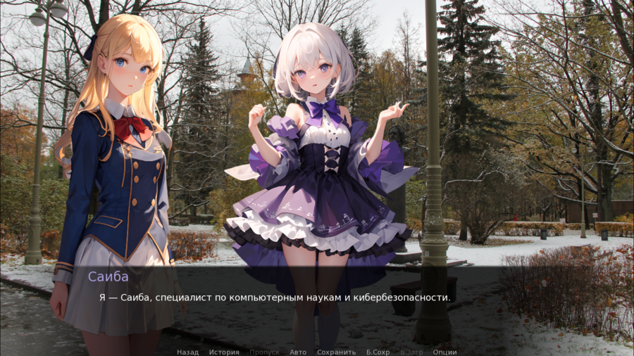

<h1>Irasshaimase to Polytech</h1>

---

**English** | [Русский](https://github.com/pinkphantasm/irasshaimase-to-polytech/blob/main/README.md)

## About

**Irasshaimase to Polytech** &mdash; a visual novel about [Peter the Great St. Petersburg Polytechnic University](https://english.spbstu.ru/). The game was developed for the hackathon of the Polytech Challenge festival by the [*Pink Phantasm*](https://github.com/pinkphantasm) team.

## Screenshots

## Installation

Pre-built packages for Windows, macOS, and Linux are found on the [Releases](https://github.com/pinkphantasm/irasshaimase-to-polytech/releases) page as well as on the project [website](https://irasshaimase.pinkphantasm.ru/) on the [Installation](https://irasshaimase.pinkphantasm.ru/en/docs/installation/) page.

